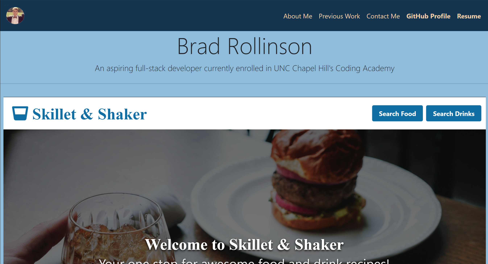

# Welcome to Brad's Portfolio

## A minimilistic page dedicated to the work and profile of Brad Rollinson, an aspiring web developer

## Link to Deployed Site

[Brad's Portfolio](https://likearollinson.github.io/unc-hw-8-portfolio/)

## Table of Contents

- [Motivation and Technologies](#motivation)
- [Functionality](#functionality)
- [Challenges](#challenges)
- [Usage](#usage)

## Motivation

The goal of this portfolio page is to showcase the skills, accomplishments, and information about Brad Rollinson.

#### Technologies

- HTML
- CSS
- Bootstrap

## Functionality

#### The screenshot shows the landing page of Brad's Portfolio.

- The page loads to a navbar with picture of Brad in the top left corner that will take the user back to the home page upon click when on any other page, and to the left links to an about me page, a previous work page, a contact page, as well as links to Brad's GitHub profile and resume
- The landing page includes clickable screenshots of some of the applications Brad has created.

## Challenges

The major challenges faced when creating this page were issues with bootstrap styling. In order to create a custom look and avoid the bootstrap default styling, there where some issues faced.

## Usage

- Showcase the work and talent of Brad Rollinson

## Future Development

- Make the page more refined
- Add more detail on the homepage
- Make the site easier to navigate so a potential employer can quickly look at the site and learn more about Brad and his work
